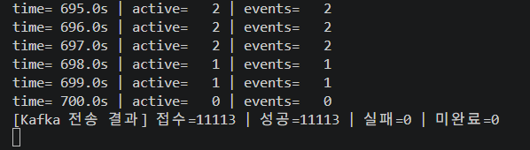
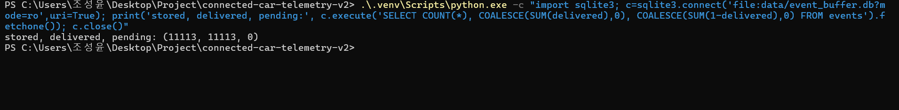
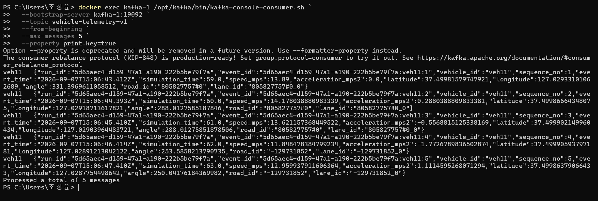
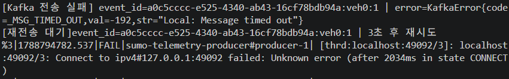

# Connected Car Telemetry 재구성기 #3 — SQLite 영속 버퍼와 Producer 재전송 구현

지난 글에서는 Kafka 브로커 한 대를 중단한 뒤 Leader 변경과 ISR 복원, 저장된 데이터의 재소비를 확인했습니다.

하지만 그 실험은 Kafka가 이미 기록한 데이터의 보존을 확인한 것이었습니다.

이번에는 Kafka에 도착하기 전의 데이터를 살펴봤습니다.

<br>

SUMO에서 차량 이벤트를 만들었는데 Kafka 연결이 끊긴다면 어떻게 될까요?

이벤트가 Producer 메모리에만 있는 상태에서 Python 프로세스가 종료되면 어떻게 복구해야 할까요?

이 구간을 추적하기 위해 이벤트 식별자를 추가하고, Kafka 전송 전에 데이터를 SQLite에 저장하도록 구성했습니다.

이후 Kafka 브로커 세 대를 모두 중단해 전송 실패와 재시도, 복구 후 완료 처리까지 확인했습니다.

<br>

## 1. 먼저 이벤트를 구분할 기준이 필요했다

기존 이벤트에는 차량 ID와 시뮬레이션 시간, 속도와 위치 등이 들어 있었습니다.

```python
{
    "vehicle_id": "veh11",
    "simulation_time": 59.0,
    "speed_mps": 13.89,
    # 위치, 가속도, 도로와 차선 정보
}
```

하지만 시뮬레이션을 다시 실행하면 같은 차량 ID와 시뮬레이션 시간이 반복됩니다.

어느 실행에서 생성한 데이터인지, 같은 이벤트를 다시 보낸 것인지 구분하려면 추가 기준이 필요했습니다.

<br>

이번에 네 필드를 추가했습니다.

| 필드 | 의미 |
|---|---|
| run_id | 시뮬레이션 실행 구분 |
| sequence_no | 해당 실행에서 차량별 이벤트 순번 |
| event_id | 개별 이벤트의 고유 식별자 |
| event_time | 이벤트 생성 시점의 UTC 시각 |

`run_id`는 실행 시작 시 UUID로 한 번 생성합니다.

```python
run_id = str(uuid4())
vehicle_sequences: dict[str, int] = {}
```

차량별 순번은 마지막 값을 기억했다가 1씩 증가시킵니다.

```python
sequence_no = vehicle_sequences.get(vehicle_id, 0) + 1
```

`event_id`는 실행 ID, 차량 ID, 차량별 순번을 조합했습니다.

```python
event_id = f"{run_id}:{vehicle_id}:{sequence_no}"
```

예를 들면 다음과 같습니다.

```text
a0c5cccc-e525-4340-ab43-16cf78bdb94a:veh0:1
```

같은 이벤트를 재전송할 때는 이 값을 새로 만들지 않고 유지합니다.

그래야 나중에 Consumer에서 동일한 이벤트를 여러 번 받았는지 구분할 수 있습니다.

<br>

## 2. 이벤트 생성 시각과 시뮬레이션 시간은 다르다

`simulation_time`은 SUMO 내부에서 경과한 시간입니다.

반면 `event_time`은 Python이 이벤트를 만드는 실제 시각입니다.

```python
event_time = datetime.now(timezone.utc).isoformat(
    timespec="milliseconds"
).replace("+00:00", "Z")
```

실제 이벤트에는 두 값이 함께 들어갑니다.

```json
{
  "event_time": "2026-09-07T15:06:43.412Z",
  "simulation_time": 59.0
}
```

시뮬레이션에서는 59초가 지났고, 해당 이벤트를 생성한 실제 시각은 UTC 기준으로 기록한 것입니다.

`event_time`이 Kafka 저장 완료 시각을 의미하는 것은 아닙니다. 수집과 전송 사이에는 SQLite 저장과 대기 시간이 있을 수 있습니다.

<br>

## 3. Producer의 메모리 큐와 Kafka 저장소 구분하기

처음에는 `produce()`를 호출하면 메시지가 바로 Kafka에 저장된다고 생각하기 쉬웠습니다.

실제로는 다음 순서입니다.

```text
SUMO 차량 상태 수집
→ Python 이벤트 생성
→ Producer 내부 메모리 큐에 접수
→ 백그라운드에서 Kafka로 전송
→ 전송 결과 확인
```

Producer 내부 큐는 Python 프로세스 쪽에 있습니다.

이 큐에만 있는 이벤트는 Python 프로세스가 강제 종료되면 사라질 수 있습니다.

<br>

기존에 설정한 Docker 볼륨은 Kafka 브로커의 저장 공간입니다. Python Producer의 메모리까지 보호하지는 않습니다.

따라서 전송 실패를 출력하는 것만으로는 부족했습니다.

전송을 완료하지 못한 이벤트를 다시 읽을 수 있는 저장소가 필요했습니다.

<br>

## 4. Kafka 전송 전에 SQLite에 저장하기

차량 내부에 통신 장애를 대비한 저장 공간이 있다고 가정하고, 이를 SQLite로 모방했습니다.

Python의 `sqlite3` 모듈로 접근하지만 실제 데이터는 디스크의 DB 파일에 저장합니다.

파일 구조는 다음과 같습니다.

```text
src/
├─ sumo_source.py
├─ kafka_producer.py
└─ event_buffer.py

data/
└─ event_buffer.db
```

각 파일의 역할은 다음과 같습니다.

| 파일 | 역할 |
|---|---|
| sumo_source.py | 차량 상태 수집, 이벤트 생성, SQLite 저장 |
| event_buffer.py | 이벤트 보관, 미완료 조회, 완료 표시 |
| kafka_producer.py | Kafka 전송, 결과 집계, 미완료 재전송 |

<br>

SQLite 테이블은 다음처럼 구성했습니다.

```sql
CREATE TABLE IF NOT EXISTS events (
    id INTEGER PRIMARY KEY AUTOINCREMENT,
    event_id TEXT NOT NULL UNIQUE,
    payload TEXT NOT NULL,
    delivered INTEGER NOT NULL DEFAULT 0
        CHECK (delivered IN (0, 1))
)
```

`payload`에는 이벤트 전체를 JSON 문자열로 저장합니다.

`delivered`는 두 상태로 구분했습니다.

```text
0 → 아직 Kafka 전송 성공을 확인하지 못함
1 → Kafka 전송 성공을 확인하고 완료 표시함
```

새 이벤트도 처음에는 `0`입니다. 미완료라고 해서 반드시 전송에 실패한 데이터라는 뜻은 아닙니다.

완료된 이벤트도 바로 삭제하지 않았습니다. 이후 저장 건수와 이벤트 ID를 대조할 때 활용하기 위해 남겨두었습니다.

<br>

## 5. 저장을 확정한 다음 전송하기

SQLite 버퍼에는 네 가지 메서드를 만들었습니다.

| 메서드 | 역할 |
|---|---|
| save() | 이벤트 저장 |
| get_pending() | 미완료 이벤트 조회 |
| mark_delivered() | 전송 완료 표시 |
| close() | DB 연결 종료 |

저장에는 다음 구조를 사용했습니다.

```python
with self.connection:
    self.connection.execute(
        """
        INSERT INTO events (event_id, payload)
        VALUES (?, ?)
        """,
        (event["event_id"], payload),
    )
```

실제 데이터 추가는 `execute()`가 수행합니다.

`with self.connection:` 블록은 정상 종료 시 변경을 커밋하고, 예외가 발생하면 롤백합니다. 따라서 `save()`가 정상적으로 끝난 다음 전송 단계로 넘어갑니다. [Python sqlite3 공식 문서](https://docs.python.org/3.13/library/sqlite3.html)

<br>

저장 설정은 다음과 같습니다.

```python
self.connection.execute("PRAGMA journal_mode=WAL")
self.connection.execute("PRAGMA synchronous=FULL")
```

WAL 방식으로 변경 내용을 기록하고, 커밋 시 로그를 디스크에 동기화하도록 설정했습니다.

이 설정이 저장장치 자체의 손실까지 보호하는 것은 아닙니다. [SQLite 공식 문서](https://www.sqlite.org/wal.html)

<br>

Source에서는 차량 이벤트를 만든 직후 저장합니다.

```python
events.append({
    # 이벤트 식별 필드와 차량 데이터
})

buffer.save(events[-1])
vehicle_sequences[vehicle_id] = sequence_no
```

해당 스텝의 이벤트를 모두 저장하면 미완료 전송을 시작합니다.

```python
producer.drain_pending()
```

SQLite 저장과 Kafka 전송을 동시에 수행하는 구조가 아니라, **SQLite 저장을 먼저 확정한 뒤 Kafka로 보내는 구조**입니다.

<br>

## 6. 전송 결과는 콜백에서 확인한다

Producer에는 세 가지 카운터를 추가했습니다.

```python
self.enqueued_count = 0
self.delivered_count = 0
self.failed_count = 0
```

`produce()`가 예외 없이 반환되면 접수 건수를 증가시킵니다.

이때는 Producer 큐 접수가 끝난 상태이며, Kafka 저장 성공이 확정된 것은 아닙니다.

최종 결과는 콜백에서 처리합니다.

```python
def _delivery_report(self, error, message):
    event = json.loads(message.value().decode("utf-8"))
    event_id = event["event_id"]

    if error is None:
        self.delivered_count += 1
        self.buffer.mark_delivered(event_id)
    else:
        self.failed_count += 1

        print(
            f"[Kafka 전송 실패] "
            f"event_id={event_id} | "
            f"error={error}"
        )
```

성공했을 때만 SQLite에 완료 표시를 합니다.

실패한 경우에는 이벤트를 삭제하지 않으므로 미완료 상태가 유지됩니다.

<br>

재전송이 추가되면서 카운터의 의미도 구분해야 했습니다.

동일한 이벤트가 실패 후 성공하면 실패와 성공에 각각 한 번씩 집계됩니다. 따라서 전송 시도 건수가 고유 이벤트 건수와 항상 같지는 않습니다.

<br>

## 7. poll()과 flush()의 역할

`poll()`은 준비된 전송 결과 콜백을 처리합니다.

```python
self.producer.poll(0)
```

`0`은 결과를 기다리지 않고 돌아오겠다는 의미입니다.

방금 접수한 이벤트의 결과뿐 아니라 이전 이벤트의 결과를 처리할 수도 있습니다.

<br>

`flush()`는 남은 전송 처리가 끝나기를 기다리면서 콜백도 처리합니다.

이번에는 한 이벤트씩 결과를 확인하기 위해 다음 코드를 사용했습니다.

```python
while self.producer.flush(timeout=1) > 0:
    pass
```

의미는 다음과 같습니다.

```text
최대 1초 기다림
→ 미완료 메시지가 남으면 다시 기다림
→ 남은 메시지가 없으면 반복 종료
```

1초마다 메시지를 다시 보내는 코드는 아닙니다. 이미 접수한 메시지의 처리가 끝나기를 기다리는 코드입니다.

또한 반환값 `0`은 미완료 메시지가 없다는 뜻입니다. 최종 실패로 처리된 메시지도 큐에서 빠질 수 있으므로, 모두 성공했다는 의미는 아닙니다. [Confluent Python API 문서](https://docs.confluent.io/platform/current/clients/confluent-kafka-python/html/index.html)

<br>

## 8. 미완료 이벤트를 다시 보내는 규칙

재전송 메서드에서는 가장 오래된 미완료 이벤트 한 개를 조회합니다.

```python
pending = self.buffer.get_pending(limit=1)

if not pending:
    return
```

미완료 이벤트가 있으면 전송하고 최종 결과를 기다립니다.

```python
event = pending[0]
failed_before = self.failed_count

self.send(event)

while self.producer.flush(timeout=1) > 0:
    pass
```

실패했다면 3초를 기다립니다.

```python
if self.failed_count > failed_before:
    print(
        f"[재전송 대기]"
        f"event_id={event['event_id']} | 3초 후 재시도"
    )
    time.sleep(3)
```

성공한 이벤트는 콜백에서 완료 표시했으므로 다음 조회 대상에서 제외됩니다.

실패한 이벤트는 미완료로 남아 있어 다음 반복에서 같은 이벤트를 다시 가져옵니다.

```text
미완료 이벤트 조회
→ 전송
    ├─ 성공 → 완료 표시 → 다음 이벤트
    └─ 실패 → 3초 대기 → 같은 이벤트 재전송
```

<br>

Producer에는 `message.timeout.ms=30000`도 설정했습니다.

클라이언트가 내부 재시도를 포함해 전송 성공을 확인하지 못하고 제한 시간을 넘기면 최종 실패 콜백을 받습니다. 이후 애플리케이션이 SQLite의 원본 이벤트로 다시 전송합니다.

재시작 시에는 새 시뮬레이션을 실행하기 전에 `drain_pending()`을 호출하도록 연결했습니다.

같은 DB 파일에서 이전 실행의 미완료 이벤트를 조회하고, 저장된 `run_id`와 `event_id`를 유지한 채 전송하도록 만든 것입니다. 이 재시작 복구 경로의 강제 종료 실험은 아직 진행하지 않았습니다.

<br>

## 9. 정상 실행에서 11,113건 전송 확인

먼저 장애를 발생시키지 않고 SUMO를 끝까지 실행했습니다.

시뮬레이션은 700초에 종료됐고, 최종 출력은 다음과 같았습니다.

```text
[Kafka 전송 결과] 접수=11113 | 성공=11113 | 실패=0 | 미완료=0
```



<br>

SQLite도 별도로 조회했습니다.

```sql
SELECT
    COUNT(*),
    COALESCE(SUM(delivered), 0),
    COALESCE(SUM(1 - delivered), 0)
FROM events;
```

결과는 다음과 같습니다.

```text
stored, delivered, pending: (11113, 11113, 0)
```



<br>

| 항목 | 결과 |
|---|---|
| SQLite 저장 | 11,113건 |
| Producer 접수 | 11,113건 |
| Kafka 전송 성공 콜백 | 11,113건 |
| 전송 실패 | 0건 |
| SQLite 미완료 | 0건 |

SQLite에 저장된 11,113건 모두 Kafka 전송 성공을 확인하고 완료 표시한 것입니다.

<br>

## 10. Kafka에서 새 이벤트 포맷 확인

Console Consumer로 토픽을 처음부터 소비하고 5건을 확인했습니다.

```powershell
docker exec kafka-1 /opt/kafka/bin/kafka-console-consumer.sh `
  --bootstrap-server kafka-1:19092 `
  --topic vehicle-telemetry-v1 `
  --from-beginning `
  --max-messages 5 `
  --formatter-property print.key=true
```

실험 당시에는 `--property print.key=true`를 사용했고, 출력에서 해당 옵션 대신 `--formatter-property`를 사용하라는 안내를 확인했습니다. 위 명령은 안내를 반영한 형태입니다.



<br>

출력된 데이터는 `veh11`의 이벤트였습니다.

```text
sequence_no:      1 → 2 → 3 → 4 → 5
simulation_time: 59 → 60 → 61 → 62 → 63
```

`run_id`, `event_id`, `sequence_no`, `event_time`이 Kafka에 전달된 것을 확인했습니다.

<br>

여기서 `kafka-1`을 지정했다고 브로커 1의 데이터만 읽는 것은 아닙니다.

해당 주소는 최초 접속점이며, Consumer는 토픽의 파티션 정보를 확인해 필요한 브로커에 연결합니다.

또한 `veh11`을 필터링한 것도 아닙니다. 토픽에서 읽은 5건이 이번에는 모두 `veh11`의 이벤트였습니다. 여러 파티션 전체를 통틀어 가장 먼저 생성된 5건이라는 의미도 아닙니다.

이 결과는 새 포맷의 샘플 수신 확인입니다. 전체 이벤트의 누락·중복 검증과는 구분했습니다.

<br>

## 11. Kafka 브로커 세 대를 모두 중단하기

정상 실행 결과를 확보한 뒤 새 시뮬레이션을 실행했습니다.

이번에는 SQLite 버퍼의 동작을 확인하기 위해 브로커 세 대를 모두 중단했습니다.

```powershell
docker stop kafka-1 kafka-2 kafka-3
```

Producer에서는 브로커 연결 실패 로그가 반복됐습니다.

이후 전송 제한 시간이 지나면서 직접 작성한 실패 콜백과 재시도 로그가 출력됐습니다.

```text
[Kafka 전송 실패]
event_id=a0c5cccc-e525-4340-ab43-16cf78bdb94a:veh0:1
error=KafkaError{
    code=_MSG_TIMED_OUT,
    val=-192,
    str="Local: Message timed out"
}

[재전송 대기]
event_id=a0c5cccc-e525-4340-ab43-16cf78bdb94a:veh0:1
3초 후 재시도
```



<br>

SQLite 조회 결과는 다음과 같았습니다.

```text
저장: 11114
완료: 11113
미완료: 1
```

이전 정상 실행의 11,113건은 완료 상태로 남아 있었고, 새 실행에서 생성한 이벤트 한 건이 미완료로 보관되어 있었습니다.

연결 실패 로그가 많이 출력되더라도 그것이 실패 이벤트의 개수를 의미하지는 않습니다.

이번에는 같은 이벤트를 유지한 채 연결과 전송을 재시도하고 있었습니다.

<br>

## 12. Kafka 복구 후 같은 이벤트의 완료 처리 확인

Python 프로그램을 종료하지 않은 상태에서 브로커를 다시 실행했습니다.

```powershell
docker start kafka-1 kafka-2 kafka-3
```

브로커가 준비되고 전송이 가능해지자 멈춰 있던 SUMO 시간이 다시 진행됐습니다.

장애 중 남아 있던 이벤트를 SQLite에서 직접 조회했습니다.

```text
event_id:
a0c5cccc-e525-4340-ab43-16cf78bdb94a:veh0:1

delivered:
1
```

동일한 이벤트가 Kafka 전송 성공 콜백을 거쳐 완료 상태로 바뀐 것을 확인했습니다.

<br>

복구 후 조회 시점의 전체 집계는 다음과 같았습니다.

```text
저장: 11212
완료: 11212
미완료: 0
```

이 수치는 두 번째 시뮬레이션의 최종 결과가 아니라, 복구 후 수집이 재개된 시점의 누적 조회 결과입니다.

이번 실험에서 확인한 흐름은 다음과 같습니다.

```text
Kafka 전체 중단
→ 전송 시간 초과
→ SQLite 미완료 유지
→ 같은 event_id로 재시도
→ Kafka 복구
→ 성공 콜백
→ SQLite 완료 표시
→ SUMO 진행 재개
```

<br>

## 13. 현재 구조는 통신 장애 중 수집도 멈춘다

구현과 실험을 진행하면서 현재 구조의 한계도 확인했습니다.

실제 차량이라면 통신이 끊겨도 센서 데이터는 계속 발생합니다. 내부 버퍼에 저장하다가 연결이 복구되면 밀린 데이터를 전송하는 동작이 필요합니다.

하지만 현재 코드는 수집과 전송을 같은 흐름에서 처리합니다.

```text
SUMO 한 스텝 진행
→ 해당 스텝 이벤트를 SQLite에 저장
→ 미완료 이벤트 전송이 끝날 때까지 대기
→ 다음 SUMO 스텝 진행
```

따라서 Kafka가 끊기면 재전송을 기다리는 동안 SUMO의 다음 스텝도 멈춥니다.

이번 실험에서도 새 이벤트가 계속 누적된 것이 아니라, 첫 미완료 이벤트 한 건을 유지하며 기다렸습니다.

<br>

이번에는 저장·전송·완료 처리의 순서를 확인하기 위해 한 건씩 기다리는 구조를 사용했습니다.

다음 단계에서는 차량 내부 버퍼에 더 가까운 동작을 만들기 위해 수집과 전송을 분리할 예정입니다.

```text
수집 작업
SUMO 진행 → 이벤트 생성 → SQLite 저장 → 수집 계속

전송 작업
SQLite 미완료 조회 → Kafka 전송 → 성공 시 완료 표시
```

이렇게 바꾸면 통신 장애 중에도 미완료 이벤트가 쌓이고, 복구 후에는 전송 작업이 밀린 데이터를 처리할 수 있습니다.

밀린 데이터를 줄이려면 복구 후 전송 처리량이 새로운 이벤트 생성량보다 커야 합니다.

<br>

## 14. 이번에 확인한 것과 아직 남은 것

이번에 확인한 내용은 다음과 같습니다.

| 항목 | 상태 |
|---|---|
| 실행·차량·이벤트 식별 필드 추가 | 구현 |
| Kafka 전송 전 SQLite 저장 | 구현 및 정상 실행 확인 |
| 전송 성공·실패 집계 | 구현 및 로그 확인 |
| 성공 콜백에서 SQLite 완료 표시 | 확인 |
| Kafka 전체 중단 시 미완료 유지 | 확인 |
| Kafka 복구 후 같은 이벤트 완료 처리 | 확인 |
| Python 강제 종료 후 재시작 복구 | 코드 경로 구현, 실험 미실시 |
| Kafka 전체 재소비 후 고유 ID 대조 | 미실시 |
| 통신 장애 중 수집 지속 | 다음 단계 |

<br>

이번 결과로 모든 구간의 무손실을 증명했다고 표현할 수는 없습니다.

현재 보호 대상으로 잡은 것은 **SQLite에 저장 완료된 이벤트**입니다.

SUMO에서 상태를 읽은 뒤 SQLite 커밋 전에 종료되는 구간이나 저장장치 자체의 손실은 별도로 다뤄야 합니다.

<br>

또한 Kafka에 저장됐지만 SQLite에 완료 표시하기 전에 Python이 종료되면, 재시작 후 같은 이벤트를 다시 보낼 수 있습니다.

Producer 멱등성 설정만으로 애플리케이션의 재전송까지 모두 제거되는 것은 아니므로, 이후 Consumer와 최종 저장소에서 `event_id`를 기준으로 중복을 처리해야 합니다.

<br>

## 다음 단계

다음에는 수집과 전송을 분리하고 장애 중에도 데이터가 계속 쌓이도록 개선할 예정입니다.

- SUMO 수집과 Kafka 전송을 별도 작업으로 분리
- 각 작업에서 같은 SQLite 파일에 별도 연결 사용
- Kafka 중단 중 미완료 이벤트 증가 확인
- 복구 후 밀린 데이터 처리와 미완료 감소 확인
- Python 강제 종료·재시작 후 이벤트 복구 실험
- SQLite와 Kafka의 event_id 대조로 누락·중복 검증
- 버퍼 용량과 완료 이벤트 정리 정책 설계

<br>

이번에는 Kafka 브로커의 복제를 넘어, Kafka에 도착하기 전 이벤트를 어디에 보관하고 어떤 기준으로 완료 처리할지 구현했습니다.

다음 실험에서는 통신이 끊겨도 수집을 계속하는 구조로 확장해보겠습니다.
